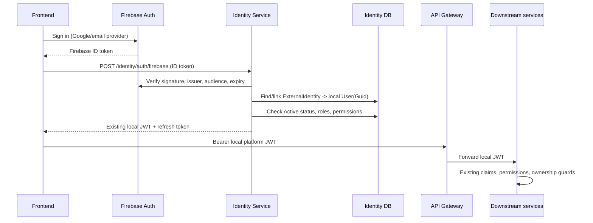

# Bao cao tien do Backend, Admin va dinh huong Firebase

**Ngay ra soat:** 2026-07-16  
**Pham vi:** source hien tai cua `MangaSystemPlatform/Server` va BRD da cung cap.  
**Luu y:** day la bao cao ra soat, khong sua code va khong chay migration/database update.

## 1. Ket luan nhanh

BRD co nhac den **Admin** nhu vai tro **quan tri he thong**, tach biet voi cac vai tro nghiep vu `Mangaka`, `Assistant`, `TantouEditor` va `EditorialBoard`. BRD goc chua dinh nghia day du tieu chi nghiep vu cho Admin; tuy nhien source hien tai da mo rong hop ly thanh quan ly user, vai tro/trang thai, permission, monitoring Gateway va outbox operations.

Trang thai hien tai:

| Pham vi | Danh gia | Ket luan |
| --- | --- | --- |
| Admin quan ly user | Da trien khai phan lon | Liet ke/chi tiet user, doi trang thai, doi roles, chan xoa Admin cuoi cung, revoke refresh token khi disable, audit event ghi nhan thay doi |
| Admin quan ly roles va permissions | Mot phan | Co permission catalog, mapping role-permission bat bien va policy; chua co API quan tri mapping/policy hay audit tra cuu |
| Admin quan sat he thong | Da trien khai muc MVP | Gateway co health tong hop, trang thai 5 downstream service va outbox summary |
| Quan tri cau hinh he thong | Chua trien khai | Moi co permission key, chua co model/API/settings governance |
| P0 Manga/Editorial/File workflow | Da co nen tang tot | Ownership, task/submission, file bridge, review, board/ranking, outbox va gateway da hien dien trong source |
| Firebase login | Chua trien khai | Khong tim thay Firebase/OIDC/external-login implementation trong source |

**Danh gia tien do (uoc luong theo source):** core backend cho vai tro noi bo da dat khoang 75%; muc san sang production thap hon do con thieu quan tri he thong day du, kiem thu integration that, secret management/deployment verification va mot so notification/reader flow.

## 2. Doi chieu BRD va kien truc hien tai

BRD ky vong Identity, Manga Management, File, Editorial, Notification va API Gateway; kien truc hien tai da co du 6 thanh phan nay, moi service co cac layer `Api`, `Application`, `Domain`, `Infrastructure`, va shared building blocks/contracts. Gateway dung YARP va da co monitoring aggregation.

| Module BRD | Trang thai | Bang chung trong source / ghi chu |
| --- | --- | --- |
| Dang ky, dang nhap, refresh token, JWT | Da trien khai | Identity `AuthController`, `AuthService`, refresh token va claims roles/permissions |
| User profile, status, roles | Da trien khai phan lon | `identity/admin/users`, `identity/admin/roles`; trang thai `Active/Disabled/Locked` |
| Permission model | Da trien khai MVP | `Permission`, `RolePermission`, permission catalog, policy/handler va seed mapping |
| Studio, series, chapter, page, annotation | Da trien khai | Ownership guards o application service theo cac P0 truoc |
| Task, submission, revision | Da trien khai | Task state workflow, assignee ownership, FileId submission |
| File upload/download va file access theo task | Da trien khai | File service va secure access bridge Manga-File |
| Editorial review va comments | Da trien khai MVP | Review queue, assign/claim reviewer, comment, approve/revision/reject |
| Editorial Board, proposal, schedule, ranking | Da trien khai MVP | Board vote, decision, schedule, reader-vote aggregate, ranking/cancellation warning |
| Notification | Da trien khai phan lon | My notifications, read/delete va SignalR hub |
| Reliable events | Da trien khai MVP | Outbox Manga/File/Editorial va logical DLQ trong DB |
| Gateway, CORS, health | Da trien khai | Route proxy, `/health`, `/health/services`, admin monitoring |
| Docker full stack | Da co cau hinh | Can kiem chung image dang chay va migration/schema tren moi moi truong |
| Reader identity va reader self-voting | Chua day du | MVP hien tai la EditorialBoard nhap vote tong hop, chua co `Reader` identity/authorization |

## 3. Admin: da co gi va con thieu gi

### Da trien khai

1. **Quan ly user**
   - `GET /identity/admin/users` va `GET /identity/admin/users/{id}`.
   - Cap nhat status va roles cua user qua admin API.
   - Khong cho disable/xoa role cua Admin dang hoat dong cuoi cung.
   - Disable user thu hoi refresh token dang hoat dong.
   - Login/refresh tu choi user khong `Active`.
   - Co development/test admin seed, chi tao khi co `SeedAdmin__Email` va `SeedAdmin__Password`; Production bo qua.

2. **Permission-based authorization**
   - Co catalog va mapping immutable: `ADMIN_USER_READ`, `ADMIN_USER_MANAGE`, `ADMIN_ROLE_READ`, `ADMIN_MONITORING_READ`, `ADMIN_OUTBOX_READ`, `ADMIN_OUTBOX_RETRY`, `ADMIN_AUDIT_READ`, `ADMIN_SYSTEM_SETTINGS_READ`.
   - Policy quan tri hien co kiem tra permission claim va `user_status=Active`, khong chi dua vao role name.
   - Admin role duoc seed voi toan bo permission catalog hien tai.

3. **Monitoring va van hanh**
   - Gateway co `/admin/monitoring/overview`, `/admin/monitoring/services`, `/admin/monitoring/outbox-summary`.
   - Manga, File va Editorial co outbox admin operations: list/detail/retry/retry failed/summary.
   - RabbitMQ consumer retry vo han, retry startup duoc log muc Information truoc nguong warning; Compose da co healthcheck RabbitMQ va `depends_on` health condition.

### Khoang trong can hoan tat

| Uu tien | Hang muc | Ly do / dau ra can co |
| --- | --- | --- |
| P0 | Admin audit read | Da co `ADMIN_AUDIT_READ` va audit event duoc ghi, nhung chua co endpoint/query paged, filter theo actor/target/action/time va retention policy |
| P0 | System settings governance | Da co `ADMIN_SYSTEM_SETTINGS_READ` nhung chua co policy dang ky, entity, API read/write, audit, validation hay phan tach secret va non-secret settings |
| P0 | Quan tri role-permission | Hien chi co catalog seed/read role. Can API read mapping, quy trinh cap quyen, audit va cache invalidation. Khong nen cho sua system permission catalog tuy y |
| P0 | Hoan tat user lifecycle | Them invite/create admin-controlled user, reset password, revoke all sessions, xem session/device, unlock co kiem soat va nhat ky thao tac |
| P0 | Lockout semantics | `Locked`/`LockoutUntil` da ton tai, nhung can xac nhan va hoan tat dem failed login, thoi gian lock, tu dong unlock va admin unlock |
| P1 | Monitoring/alerting | Them metrics, dashboard, canh bao health/outbox failed, correlation ID va SLA. Hien Gateway chi tong hop polling health |
| P1 | Physical DLQ va replay operational | Logical DLQ `Failed` trong DB da co; chua cau hinh RabbitMQ DLX/parking queue va operational runbook day du |

## 4. Cac khoang trong BE ngoai Admin

1. **Notification chua phu toan bo event nghiep vu.** Mot so handler chi log do event khong mang du recipient ro rang, dac biet `TaskApprovedEvent`, `RankingCalculatedEvent` va `CancellationWarningCreatedEvent`. Can bo sung recipient/user context trong event hoac consumer lookup an toan, sau do co test E2E notification.
2. **Reader flow chua co.** Neu BRD yeu cau doc gia tu vote, can them Reader identity/profile, anti-abuse/rate-limit va reader vote ownership. Neu MVP chi nhap so lieu tong hop, can chot ro trong BRD/API la `board-entered aggregate`, khong goi la reader self-vote.
3. **File side effects va validation lien service.** Upload storage co the xay ra truoc database transaction; can compensation/cleanup job. Submission dang luu FileId theo MVP, can xac nhan file ton tai va quyen truy cap bang contract noi bo khi can.
4. **Editorial review assignment MVP.** Tantou Editor co the thay review Pending va nhan review khi start/comment. Phu hop MVP, nhung chua co co che manager assignment, reassign, SLA/due date hay escalation.
5. **Event operations.** Outbox da giam nguy co mat event sau transaction, nhung can tenant/production proof voi RabbitMQ, physical DLQ, replay approval/audit va monitoring alert khi retry vuot nguong.
6. **Integration test depth.** Test application/unit da phu cac P0; can them test voi PostgreSQL, RabbitMQ, MinIO, Gateway WebSocket/SignalR va Docker Compose trong CI.
7. **Migration/deployment hygiene.** Mot so outbox migration truoc do tao thu cong do `dotnet ef` CLR startup `0x80004005`; snapshot/designer can duoc regenerate truoc migration ke tiep. Can co CI migration smoke test tren DB trong sach, khong tu dong update DB production.
8. **Security/operations.** Can dua secrets JWT, DB, RabbitMQ, MinIO, Firebase service account ra secret store/CI secret; khong dua key vao source hay `.env` production. Them rate limit, password policy, audit retention va backup/restore drill.

## 5. Backlog de hoan tat luong, theo thu tu uu tien

| Thu tu | Priority | Chu so huu chinh | Cong viec va dieu kien hoan thanh |
| --- | --- | --- | --- |
| 1 | P0 | BA + PM + Technical Lead | Chot acceptance criteria Admin: ai duoc tao/disable/unlock user; role nao duoc sua mapping; system settings nao la non-secret; retention audit bao lau |
| 2 | P0 | Backend Identity | Hoan tat Admin Audit API, query/filter/paging, policy `RequireAdminAuditRead`, audit immutable va test phan quyen |
| 3 | P0 | Backend Identity | Hoan tat user lifecycle: reset password/invite, revoke sessions, unlock, lockout failed-login va test cac trang thai |
| 4 | P0 | Backend Identity + TL | Role-permission administration co kiem soat: read mapping, change workflow, audit, cache invalidation; catalog system permission van immutable theo release |
| 5 | P0 | Backend + BA | Chot Reader scope: giu aggregate voting (cap nhat BRD/API naming) hoac them Reader identity va reader self-vote. Khong nen de hai nghia vu song song |
| 6 | P0 | Backend Manga/Editorial/Notification | Bo sung recipient context/lookup va test notification cho task approved, ranking va cancellation warning |
| 7 | P0 | DevOps + TL | Chuan hoa migration runbook/CI, xac nhan Docker images dang chay dung source moi, health Gateway/downstream va secret injection theo moi truong |
| 8 | P1 | Backend + DevOps | Physical RabbitMQ DLQ/parking queue, alert outbox failed, dashboard metrics/tracing, replay co audit |
| 9 | P1 | Backend File | File cleanup compensation, virus scan/content policy, quota va kiem tra FileId lien service |
| 10 | P1 | QA + Backend | Compose integration tests voi Postgres/RabbitMQ/MinIO/SignalR va contract tests qua Gateway |

## 6. Dinh huong Firebase Login cho microservices

### Ket luan kien truc

**Dat Firebase integration tai Identity Service, khong dat tai Gateway va khong dat lai o tung downstream service.** Gateway va cac service tiep tuc tin cay **local platform JWT** do Identity phat hanh. Cach nay giu nguyen `User.Id` kieu `Guid`, roles, permissions, user status, ownership guard, refresh-token flow va public contracts noi bo.

Khong khuyen nghi frontend gui Firebase ID token truc tiep den toan bo microservice: khi do moi service/Gateway phai lap lai token verification, mapping local status/permission se phan tan, va policy hien co de mat nguon su that duy nhat.

### Luong de xuat: Firebase token exchange



### Dat thanh phan o dau

| Thanh phan | Trach nhiem |
| --- | --- |
| Frontend | Dang nhap Firebase, lay Firebase ID token va goi token-exchange endpoint; khong tu gan role Admin |
| Identity Application | `IExternalTokenVerifier`, command token exchange/link account, quy tac disabled user va conflict email |
| Identity Infrastructure | `FirebaseTokenVerifier` dung Firebase Admin SDK hoac Google OIDC verifier; truy cap credential/config |
| Identity Domain/EF | Them `ExternalIdentity` (hoac `UserExternalLogin`) lien ket local `UserId: Guid` voi `Provider` va Firebase `Subject/uid` |
| Gateway | Khong verify Firebase token trong phase nay; tiep tuc validate/forward local JWT nhu hien tai |
| Manga/File/Editorial/Notification | Khong can sua auth contract; nhan local GUID/roles/permissions nhu hien tai |

### Model du lieu va migration toi thieu

Them bang Code First `external_identities`:

| Field | Ghi chu |
| --- | --- |
| `Id` | Guid primary key |
| `UserId` | Guid FK den local User, **khong doi User.Id thanh string** |
| `Provider` | `Firebase` (co the mo rong Google/Microsoft sau nay) |
| `Subject` | Firebase `uid`; unique cung `Provider` |
| `EmailAtLink` | Snapshot de audit, khong dung lam identity key duy nhat |
| `CreatedAt`, `LastSeenAt` | Audit va operational trace |

Can unique index `(Provider, Subject)` va index `UserId`. Migration chi chay rieng cho Identity DB sau khi duoc phe duyet.

### Cau hinh an toan

Chi Identity Service can cac key nay:

```text
Firebase__ProjectId=<firebase-project-id>
Firebase__AllowedProviders=google.com,password
Firebase__RequireEmailVerified=true
Firebase__CredentialPath=/run/secrets/firebase-service-account.json   # local/dev only
GOOGLE_APPLICATION_CREDENTIALS=/run/secrets/firebase-service-account.json
```

- Local development: service account JSON nam ngoai repository, duoc `.gitignore`; cap qua secret mount hay environment path.
- Docker/CI/production: dung Docker/Kubernetes secret, cloud secret manager hoac workload identity. Khong nhet JSON/private key vao `appsettings*.json`, `.env` shared hay Gateway.
- Firebase console: tao project, bat provider can dung (Google/email-password), khai bao authorized domains/redirect origins cua frontend, va tao service account chi cho Identity runtime.
- Gia tri `ProjectId`, issuer `https://securetoken.google.com/{ProjectId}`, audience, expiry, signature/key rotation va `email_verified` phai duoc verify server-side.

### Quy tac bao mat va mapping

1. Xac minh Firebase token truoc khi lookup user: signature, issuer, audience, expiration, subject va provider allow-list.
2. Map bang `(Provider, Subject)` truoc tien. Khong tu dong merge chi dua vao email; khi link lan dau, email phai verified va email conflict can co flow xac minh/approval ro rang.
3. Local User van la source of truth cho `Active/Disabled/Locked`, roles, permissions va ownership. Firebase custom claims khong duoc cap quyen Admin.
4. User local bi Disabled/Locked phai bi tu choi token exchange du Firebase token van hop le.
5. Identity phat local JWT/refresh token nhu hien tai; JWT co local user GUID, status, role va permission claims. Thoi han JWT ngan va revoke session khi admin thay doi trang thai/role.
6. Giu local password login trong giai doan migration hoac chi giu cho bootstrap Admin. Chi deprecate sau khi rollout, telemetry va recovery flow on dinh.

### Ke hoach trien khai Firebase

| Phase | Dau ra |
| --- | --- |
| F0 - BA/Security | Chot provider, link-account UX, email conflict, admin bootstrap/recovery, retention va rollback |
| F1 - Identity model | `ExternalIdentity`, migration Identity DB, repository/service va audit events |
| F2 - Verification | Firebase Admin/OIDC verifier, options validation, secret wiring chi o Identity |
| F3 - API | `POST /identity/auth/firebase`, response dung contract login/refresh hien co neu co the |
| F4 - Tests | Valid token, invalid issuer/audience/expired token, disabled user, duplicate uid, email conflict, local JWT co `ADMIN_USER_READ`/`ADMIN_MONITORING_READ` |
| F5 - Rollout | Feature flag, canary, telemetry login failure, giu local fallback, sau do moi deprecate local login neu duoc phe duyet |

## 7. Verification va rui ro con lai

- Lich su verify gan nhat cua codebase truoc cuoc ra soat nay ghi nhan solution build thanh cong va **91/91 tests pass**. Bao cao nay khong sua code nen khong chay lai build/test.
- Firebase chua ton tai trong code; day la workstream moi va can migration Identity DB.
- Can xac nhan Docker deployment dung image moi truoc khi coi monitoring/outbox endpoint da san sang o moi moi truong.
- Khong tu dong database update. Migration outbox truoc do can snapshot/designer regenerate khi `dotnet ef` CLR startup da duoc khac phuc.

## 8. Quyet dinh de PM/BA chot truoc sprint tiep theo

1. Reader co phai la actor dang nhap va tu vote hay chi la du lieu aggregate do Board nhap?
2. Admin co duoc tao user, reset password, unlock va sua role-permission trong production khong; can four-eyes approval hay khong?
3. System settings nao duoc phep sua runtime, setting nao chi duoc deploy qua secret/configuration?
4. Firebase co thay the hoan toan local login hay chi them Google/Firebase song song; bootstrap/recovery Admin se dung co che nao?

Sau khi cac quyet dinh nay duoc chot, thu tu thuc hien khuyen nghi la: **Admin completion -> notification/reader gap -> Firebase Identity token exchange -> deployment/observability hardening**.
