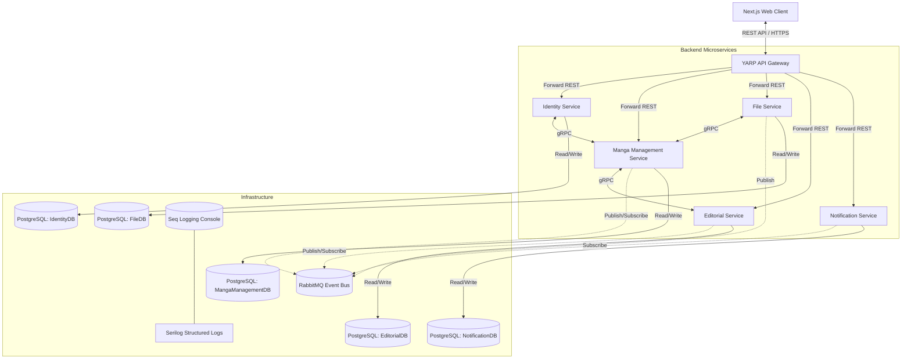

# BÁO CÁO ĐÁNH GIÁ KỸ THUẬT CHUYÊN SÂU (TECHNICAL AUDIT REPORT)
## Hệ thống Quản lý Quy trình Sáng tác và Xuất bản Manga (MangaSystemPlatform)

> [!NOTE]  
> Báo cáo này được thực hiện bởi **Senior Software Architect kiêm Technical Project Auditor** nhằm đánh giá toàn diện trạng thái hiện tại của hệ thống, chỉ rõ các thành phần đã triển khai, các lỗ hổng kỹ thuật (gaps), các rủi ro bảo mật/vận hành (technical risks) và đề xuất lộ trình hành động (roadmap) đưa hệ thống lên production-ready.

---

## 1. Tổng Quan Hệ Thống & Đánh Giá Kiến Trúc (Architecture & Structure Review)

Hệ thống **MangaSystemPlatform** được thiết kế và triển khai dựa trên **.NET 8**, áp dụng mô hình **Microservices** kết hợp **Clean Architecture** tại mỗi service riêng biệt. Qua rà soát mã nguồn, hệ thống thể hiện mức độ hoàn thiện cấu trúc rất cao và tuân thủ chặt chẽ các nguyên lý thiết kế hiện đại.

### 1.1 Sơ đồ Kiến trúc & Luồng Dữ liệu (System Architecture)

Dưới đây là sơ đồ mô tả luồng giao tiếp giữa client, API Gateway, các microservices thông qua giao thức gRPC (đồng bộ - phục vụ validate/lookup) và RabbitMQ (bất đồng bộ - phục vụ workflow/notification):



### 1.2 Đánh giá Cấu trúc Thư mục & Clean Architecture
Mỗi microservice viết bằng C# (`identity-service`, `manga-service`, `file-service`, `editorial-service`, `notification-service`) đều tuân thủ cấu trúc **Clean Architecture** với 4 dự án con (projects):
1. **`.Domain`**: Chứa các Entity, Value Object, Enum và các rule nghiệp vụ cốt lõi. Lớp này hoàn toàn cô lập, không tham chiếu đến bất kỳ thư viện hay lớp nào khác bên ngoài.
2. **`.Application`**: Định nghĩa các Interface, DTO, Domain Event Handler, logic nghiệp vụ chính (Services/Use Cases). Lớp này chỉ phụ thuộc vào `.Domain`.
3. **`.Infrastructure`**: Triển khai các DbContext (EF Core), Repository, gRPC Client, kết nối RabbitMQ và các dịch vụ bên thứ ba. Lớp này phụ thuộc vào `.Application` và `.Domain`.
4. **`.Api`**: Điểm khởi chạy ứng dụng (Entrypoint), chứa Controllers (chỉ nhận HTTP Request, gọi Application Service và trả về DTO - không trả Entity trực tiếp), Web Middlewares, cấu hình Dependency Injection và Swagger.

> [!TIP]  
> **Ưu điểm**: Không phát hiện bất kỳ vòng lặp phụ thuộc (cyclic references) hay tham chiếu sai chiều (như Domain tham chiếu Infrastructure). Các service hoàn toàn độc lập về mặt dữ liệu (Database-per-service).

### 1.3 Đánh giá các Shared Projects (Building Blocks)
Hệ thống sử dụng các thư viện dùng chung rất hiệu quả để chuẩn hóa luồng xử lý:
*   `Manga.Contracts`: Định nghĩa tập trung các file gRPC `.proto` (thư mục `Protos`) và các Integration Event (thư mục `Events` dạng C# records) nhằm chia sẻ hợp đồng giao tiếp giữa các service, tránh duplicate code.
*   `Manga.BuildingBlocks`: Chứa các middleware xử lý lỗi toàn cục (`GlobalExceptionHandlingMiddleware`), ghi log request (`RequestLoggingExtensions`), theo dõi correlation ID (`CorrelationIdMiddleware`), và bộ thư viện bọc RabbitMQ (`RabbitMqEventBus`, `RabbitMqEventConsumer`).
*   `Manga.SharedKernel`: Chứa các định nghĩa chung như cấu trúc phân trang, thực thể gốc (Entity base), hoặc kết quả trả về (`Result<T>`).

---

## 2. API Gateway (YARP Gateway)

Dự án sử dụng **YARP (Yet Another Reverse Proxy)** của Microsoft làm API Gateway chính, chịu trách nhiệm tiếp nhận và định tuyến toàn bộ traffic từ client vào các microservices nội bộ.

### 2.1 Định tuyến & Cấu hình REST API
Gateway định tuyến các request dựa trên tiền tố đường dẫn (path prefix):
*   `/identity/{**catch-all}` $\rightarrow$ định tuyến đến Identity API (`http://localhost:5207`)
*   `/manga/{**catch-all}` $\rightarrow$ định tuyến đến Manga Management API (`http://localhost:5078`)
*   `/files/{**catch-all}` $\rightarrow$ định tuyến đến File API (`http://localhost:5154`)
*   `/editorial/{**catch-all}` $\rightarrow$ định tuyến đến Editorial API (`http://localhost:5206`)
*   `/notifications/{**catch-all}` $\rightarrow$ định tuyến đến Notification API (`http://localhost:5210`)

### 2.2 Bảo mật & Forwarding
*   **JWT Passthrough**: Gateway không thực hiện xác thực/phân quyền tập trung ở phase này mà giữ nguyên header `Authorization: Bearer <token>` và chuyển tiếp trực tiếp xuống các service downstream để tự validate. Điều này giúp giảm tải cho Gateway và giữ cho logic phân quyền phân tán linh hoạt.
*   **Cô lập gRPC**: Gateway chỉ mở các REST API port. Các port gRPC (6207, 6154, 6078, v.v.) hoàn toàn đóng với bên ngoài, đảm bảo an toàn cho giao tiếp nội bộ.
*   **CORS**: Cấu hình mở cho frontend hoạt động tại `http://localhost:3000` (Next.js) và `http://localhost:5173` (Vite dev server).

### 2.3 Cơ chế Downstream Health Checking
Gateway triển khai một endpoint đặc biệt tại `/health/services`. Endpoint này tự động:
1. Đọc danh sách địa chỉ của toàn bộ downstream service đang được cấu hình trong YARP Cluster.
2. Thực hiện gọi HTTP GET đồng thời tới endpoint `/health` của từng service con.
3. Tổng hợp trạng thái (`Healthy` / `Unhealthy`) thành một JSON phản hồi duy nhất. Điều này cực kỳ hữu ích cho hệ thống monitor bên ngoài.

---

## 3. Đánh Giá Chi Tiết Các Microservices

### 3.1 Identity Service
*   **Nghiệp vụ REST**: Đã hoàn thiện toàn bộ luồng Auth chuẩn bao gồm Đăng ký (mặc định gán role `Mangaka`), Đăng nhập, Refresh Token (lưu trữ token trong DB và hỗ trợ cơ chế thu hồi/revoke), Đăng xuất (xóa token), và lấy Profile người dùng hiện tại qua `/identity/users/me`.
*   **Bảo mật**: Mật khẩu được mã hóa an toàn bằng `IPasswordHasher` (BCrypt/PBKDF2 tương đương). Hỗ trợ phân quyền dựa trên Policy (ví dụ: `AdminOnly`, `EditorialOnly`).
*   **Cung cấp gRPC Contract (`identity.proto`)**: Expose 3 endpoints phục vụ định danh chéo:
    *   `CheckUserExists`: Xác minh nhanh sự tồn tại và trạng thái kích hoạt (`IsActive`) của user.
    *   `GetUserSummary`: Trả về Profile tóm tắt (UserId, Email, DisplayName, Roles, IsActive).
    *   `CheckUserRole`: Kiểm tra xem user có sở hữu một role cụ thể hay không.

### 3.2 Manga Management Service
Đây là trung tâm của các quy trình nghiệp vụ sáng tác truyện tranh.
*   **Nghiệp vụ REST**: Quản lý Studio (và thành viên Studio), Series (Bộ truyện), Chapter (Chương), Page (Trang truyện), Annotation (Ghi chú biên tập), Task (Nhiệm vụ vẽ), Submission (Bài nộp của trợ lý) và Revision (Yêu cầu sửa đổi).
*   **Tích hợp gRPC Client (Validate chéo)**:
    *   *Khi giao Task*: Gọi gRPC sang Identity Service kiểm tra xem `AssignedToUserId` có tồn tại hay không và bắt buộc phải có role `Assistant`.
    *   *Khi tạo Page hoặc Submit Task*: Gọi gRPC sang File Service để kiểm tra xem `FileId` đính kèm có tồn tại và đang ở trạng thái `Active` hay không.
*   **Event-Driven (RabbitMQ)**:
    *   *Publish*: Đẩy các sự kiện `TaskAssignedEvent` (khi giao việc), `TaskSubmittedEvent` (trợ lý nộp bài), `TaskApprovedEvent` (biên tập viên duyệt bài).
    *   *Consume*: Sử dụng **Inbox Pattern** thông qua bảng `inbox_messages` để lưu trữ và xử lý idempotent các sự kiện nhận về:
        *   `FileUploadedEvent` (Nhận thông báo file tải lên thành công để liên kết metadata).
        *   `ChapterApprovedEvent` (Khi chapter được Editorial duyệt thông qua, Manga tự động chuyển trạng thái chapter sang `Approved`).
        *   `RankingCalculatedEvent` (Nhận tin nhắn tính toán xếp hạng để cập nhật chỉ số).

### 3.3 File Service
*   **Nghiệp vụ**: Quản lý tải lên (Multipart form-data), lưu trữ, tải xuống, soft delete, lấy URL công khai và lịch sử phiên bản file (`FileVersion`).
*   **Cơ chế lưu trữ**:
    *   *Database*: Chỉ lưu metadata của file (tên gốc, định dạng, kích thước, category, public URL, trạng thái). Tuyệt đối không lưu file binary vào DB.
    *   *Storage Provider*: Hiện tại đang đăng ký sử dụng `LocalFileStorageService` (lưu vật lý trên ổ đĩa local của server tại thư mục cấu hình và phục vụ qua Static Files Middleware). Thành phần MinIO (Object Storage) mới chỉ có cấu hình và health check cấu hình, chưa có code implementation kích hoạt cho môi trường chạy thực tế.
*   **gRPC Contract (`file.proto`)**: Expose endpoints `FileExists` và `GetFileMetadata`.
    *   *Bảo mật dữ liệu*: gRPC response trả về metadata được lọc bỏ các thông tin nhạy cảm về hạ tầng lưu trữ (như đường dẫn tuyệt đối trên ổ đĩa `StoragePath` hoặc loại `StorageProvider` sử dụng), bảo vệ an toàn hệ thống file nội bộ.
*   **Event-Driven**: Publish `FileUploadedEvent` ngay khi file được ghi đĩa thành công.

### 3.4 Editorial Service
*   **Nghiệp vụ REST**: Quản lý hàng đợi kiểm duyệt (Editorial Reviews), bình luận biên tập liên kết trực tiếp tới vị trí trang/tọa độ vẽ (`EditorialComment`), bầu chọn của hội đồng nghệ thuật (`BoardVotes`), xuất bản tạp chí tuần/tháng (`Issues`), lịch xuất bản chương truyện (`PublicationSchedules`), phiếu bầu của độc giả (`ReaderVotes`), tính điểm/bảng xếp hạng truyện (`RankingSnapshots`) và cảnh báo hủy bỏ tác phẩm (`CancellationWarnings`).
*   **Business Rules Phức Tạp**:
    *   Hội đồng nghệ thuật: Mỗi biên tập viên chỉ được vote 1 lần cho mỗi đợt duyệt tác phẩm.
    *   Cảnh báo hủy (Cancellation Warning): Tự động tính toán dựa trên xếp hạng. Nếu bộ truyện nằm trong nhóm cuối bảng xếp hạng (ví dụ: top 3 từ dưới lên hoặc hạng dưới 10) liên tiếp, hệ thống tự động sinh cảnh báo và gửi sự kiện đi.
*   **Tích hợp gRPC Client**: Gọi sang Manga Service để kiểm tra tính hợp lệ của Series/Chapter trước khi khởi tạo một đợt đánh giá `EditorialReview`.
*   **Event-Driven**:
    *   *Publish*: Publish `ChapterApprovedEvent` (khi duyệt thông qua chapter), `RankingCalculatedEvent` (khi tính xong bảng xếp hạng), và `CancellationWarningCreatedEvent` (khi phát hiện truyện có nguy cơ bị hủy).
    *   *Consume*: Sử dụng Inbox Pattern để xử lý: `TaskAssignedEvent`, `TaskSubmittedEvent`, `ChapterSubmittedForReviewEvent` (để tự động mở hàng đợi đánh giá).

### 3.5 Notification Service
*   **Nghiệp vụ REST**: Cung cấp API quản lý danh sách thông báo của người dùng (`GET /notifications/my`), đếm số thông báo chưa đọc, đánh dấu đã đọc hoặc xóa thông báo.
*   **Event-Driven (RabbitMQ)**:
    *   Service này là một "Consumer thuần túy". Nó lắng nghe toàn bộ các sự kiện trong hệ thống (`TaskAssignedEvent`, `TaskSubmittedEvent`, `TaskApprovedEvent`, `ChapterSubmittedForReviewEvent`, `ChapterApprovedEvent`, `RankingCalculatedEvent`, `CancellationWarningCreatedEvent`, `FileUploadedEvent`) thông qua Inbox Pattern.
    *   Mỗi khi có sự kiện, nó phân tích người nhận tương ứng và ghi nhận một bản ghi thông báo vật lý vào bảng `notifications` của `NotificationDB`.

---

## 4. Tính Quan Sát & Chất Lượng (Observability & Quality)

### 4.1 Log Tập Trung (Serilog + Seq)
Tất cả các service (bao gồm cả Gateway) được cấu hình tích hợp **Serilog** ghi log có cấu trúc trực tiếp ra Console và đẩy về **Seq** (`http://localhost:5341`). Log chứa đầy đủ các thông tin:
*   `Application`: Định danh service sinh log.
*   `CorrelationId`: Mã định danh luồng xử lý xuyên suốt.
*   `UserId` (nếu có): Định danh user thực hiện hành động.
*   `ElapsedMilliseconds`: Thời gian xử lý request/gRPC call.

### 4.2 Hệ thống Health Checks phong phú
Cấu hình health check cực kỳ chi tiết bao gồm:
*   Database connection: Kiểm tra kết nối PostgreSQL qua NpgSql.
*   Message broker connection: Kiểm tra kết nối tới RabbitMQ.
*   gRPC Target & Configurations validation: Sử dụng class custom `InternalGrpcConfigurationHealthCheck` để xác minh tính hợp lệ của cấu hình URI gRPC và sự tồn tại của Internal API Key mà không làm lộ khóa bí mật trong log.

### 4.3 Chất lượng Kiểm thử (Testing Coverage)
Dự án có bộ kiểm thử tích hợp tự động rất tốt đặt tại dự án `MangaSystemPlatform.GrpcIntegrationTests` sử dụng xUnit, FluentAssertions và Microsoft `TestHost`/`TestServer` trong bộ nhớ.
*   **Số lượng test**: **26 integration tests** và tất cả đều **Passed** thành công 100%.
*   **Nội dung test**:
    *   *Contract gRPC*: Kiểm tra tính đúng đắn của serialization/deserialization và logic phản hồi của 3 service Identity, File, Manga.
    *   *Bảo mật gRPC*: Xác nhận request không có API Key hoặc sai API Key lập tức bị chặn ở mức HTTP status `Unauthenticated` (mã lỗi gRPC `StatusCode.Unauthenticated`).
    *   *Luồng nghiệp vụ (Business Flows)*: Test toàn bộ chuỗi nghiệp vụ tạo task, tạo page, submit task, tạo editorial review có đi qua các gRPC mock client và assert số lượng tin nhắn đẩy lên event bus giả lập.
    *   *Resilience*: Test giả lập service đích bị sập (down) để đảm bảo client bắt exception an toàn và trả về validation error thay vì làm crash luồng ứng dụng chính.
    *   *Health Check*: Test tính đúng đắn của logic Health Check gRPC.

### 4.4 Smoke Test Scripts
Hệ thống cung cấp sẵn các script PowerShell (`scripts/grpc-smoke-tests/`) sử dụng công cụ `grpcurl` để cho phép quản trị viên hoặc kỹ sư DevOps dễ dàng gọi trực tiếp gRPC endpoint thủ công trên môi trường chạy thực tế để chẩn đoán lỗi nhanh.

---

## 5. Kẽ Hở & Rủi Ro Kỹ Thuật (Gaps & Technical Risks)

Qua quá trình kiểm tra sâu mã nguồn, tôi đã phát hiện ra một số điểm yếu và lỗi thiết kế nghiêm trọng cần phải khắc phục trước khi golive.

### 5.1 Rủi ro nghiêm trọng (Critical Risk): Lỗi đồng bộ Correlation ID trong gRPC Client Interceptor
Hệ thống mong muốn theo dõi luồng xử lý chéo microservices thông qua Correlation ID bằng cách sử dụng `CorrelationIdMiddleware` (lưu ID vào `CorrelationIdContext.Current` dùng `AsyncLocal`). Tuy nhiên, trong mã nguồn gRPC Interceptor có lỗi logic lớn:

1.  **Tại `InternalGrpcClientInterceptor.cs` (Dòng 35):**
    ```csharp
    var correlationId = _configuration["CorrelationId"];
    ```
    > [!CAUTION]  
    > **Sai lầm**: Interceptor cố gắng đọc Correlation ID từ file cấu hình của ứng dụng (`IConfiguration`) thay vì đọc từ ngữ cảnh xử lý bất đồng bộ hiện tại (`CorrelationIdContext.Current`). Vì cấu hình ứng dụng không bao giờ chứa khóa này lúc runtime, giá trị `correlationId` luôn là `null`/trống. Dẫn đến header `x-correlation-id` gửi sang gRPC service khác bị mất hoặc thiếu.

2.  **Tại `InternalGrpcServerInterceptor.cs`:**
    *   Interceptor server chỉ thực hiện ghi log correlation ID nhận được từ header:
        ```csharp
        GetHeaderValue(context.RequestHeaders, "x-correlation-id")
        ```
    > [!WARNING]  
    > **Thiếu sót**: Interceptor này hoàn toàn **không** thiết lập giá trị này vào `CorrelationIdContext.Current` của thread xử lý gRPC hiện tại. Do đó, nếu bên trong handler của gRPC tiếp tục gọi xuống database hoặc publish event lên RabbitMQ, log của các thao tác này sẽ không có Correlation ID hoặc sinh ra một ID mới hoàn toàn, làm gãy chuỗi trace log (trace break).

### 5.2 Gaps về hạ tầng & Tính năng (Infrastructure & Feature Gaps)
*   **Thiếu Real-time Push ở Backend (SignalR Hub)**:
    *   *Phía Client Next.js*: Đã có sẵn file `lib/signalr.ts` và sử dụng thư viện `@microsoft/signalr` sẵn sàng kết nối nhận thông báo thời gian thực.
    *   *Phía Backend*: `notification-service` hoàn toàn **chưa** cấu hình SignalR Hub hay bất kỳ cơ chế WebSockets nào. Notification hiện tại chỉ được lưu vào DB PostgreSQL. Độc giả/mangaka trên frontend sẽ không nhận được thông báo lập tức trừ khi họ reload lại trang hoặc gọi API polling.
*   **Chưa chuyển đổi MinIO cho Storage**:
    *   Mặc dù Docker Compose đã dựng sẵn cụm MinIO (`http://localhost:9001`) và hệ thống có class check health MinIO, nhưng `File Service` thực tế vẫn đang cứng cấu hình (hardcoded) sử dụng local storage. Việc ghi đĩa local này sẽ không thể scale-out (chạy nhiều bản sao container) trên môi trường production (Kubernetes/ECS) trừ khi dùng Shared Volume (EFS) - phương án vốn kém hiệu năng hơn so với Object Storage như MinIO/S3.
*   **Frontend Client thiếu kết nối API thật**:
    *   Hầu hết các trang nghiệp vụ chính trên Next.js (`dashboard`, `series`, `tasks`, `files`, `editorial`) hiện tại đang sử dụng hoàn toàn dữ liệu giả (mock data) khai báo cứng trong component, chưa gọi API thật qua gateway thông qua các store quản lý trạng thái (Zustand). Chỉ có trang Login/Register là đã có tích hợp cơ bản.
*   **Hiệu năng RabbitMQ Event Bus**:
    *   `RabbitMqEventBus.cs` khởi tạo Connection và Channel mới trên **mỗi** lượt publish tin nhắn (`using var connection = factory.CreateConnection(); using var channel = connection.CreateModel();`). Cách làm này rất tốn tài nguyên và dễ gây nghẽn cổ chai (bottleneck) khi tần suất đẩy event cao. Trong môi trường production, Connection và Channel cần được giữ lại và tái sử dụng (pooling/persistent connection).

---

## 6. Lộ Trình Hành Động Đề Xuất (Actionable Roadmap)

Dưới đây là các đầu việc chi tiết được phân loại theo độ ưu tiên để hoàn thiện hệ thống:

### Độ Ưu Tiên: CAO (High Priority) - Khắc phục ngay lỗi hệ thống & bảo mật

| STT | Thành phần | Mô tả công việc | Kết quả mong đợi |
| :--- | :--- | :--- | :--- |
| 1 | **gRPC Interceptor** | Sửa bug truyền Correlation ID ở client và server gRPC interceptors. Sử dụng `CorrelationIdContext.Current` thay vì `_configuration`. | Correlation ID được truyền xuyên suốt qua gRPC và ghi nhận đầy đủ trong Seq logs. |
| 2 | **RabbitMQ Bus** | Refactor `RabbitMqEventBus` để chia sẻ và tái sử dụng một connection/channel duy nhất thay vì tạo mới liên tục. | Tối ưu hóa tài nguyên mạng, cải thiện throughput phát event lên gấp nhiều lần. |
| 3 | **MinIO Storage** | Implement `MinioFileStorageService` trong File Service và cấu hình chuyển đổi qua biến môi trường để sẵn sàng scale-out container. | File upload được lưu tập trung trên MinIO Object Storage thay vì ổ đĩa local của container. |

### Độ Ưu Tiên: TRUNG BÌNH (Medium Priority) - Hoàn thiện các tính năng cốt lõi

| STT | Thành phần | Mô tả công việc | Kết quả mong đợi |
| :--- | :--- | :--- | :--- |
| 1 | **SignalR Realtime** | Thiết lập SignalR Hub tại `notification-service`. Mỗi khi consumer nhận event và lưu DB xong, push thông báo ngay tới user qua Hub. | Người dùng nhận notification realtime trên giao diện Next.js mà không cần reload trang. |
| 2 | **Frontend Integration** | Thay thế mock data trên các trang Next.js (Series, Tasks, Editorial, Files) bằng các lệnh gọi Axios/Fetch thật qua API Gateway. | Ứng dụng hoạt động end-to-end từ giao diện người dùng đến database. |
| 3 | **Database Migration** | Cấu hình cơ chế tự động chạy Migration khi khởi chạy container trong file `entrypoint.sh` hoặc tại `Program.cs` của mỗi service. | Việc deploy lên môi trường mới (staging/prod) tự động cập nhật schema DB mà không cần chạy lệnh thủ công. |

### Độ Ưu Tiên: THẤP (Low Priority) - Tối ưu hóa & Hardening hệ thống

| STT | Thành phần | Mô tả công việc | Kết quả mong đợi |
| :--- | :--- | :--- | :--- |
| 1 | **AI Service Integration** | Triển khai logic thực sự cho Python FastAPI AI Service (như tự động phân tích ảnh trang truyện, gợi ý sửa đổi, dịch thuật). | Hoàn thiện tính năng AI hỗ trợ mangaka và trợ lý vẽ. |
| 2 | **mTLS / Network Security** | Triển khai mã hóa đường truyền gRPC nội bộ bằng TLS (hoặc qua Service Mesh như Istio/Linkerd nếu chạy trên Kubernetes). | Giao tiếp service-to-service được mã hóa bảo mật tuyệt đối, chống nghe lén dữ liệu nội bộ. |
| 3 | **Dead Letter Queue (DLQ)** | Cấu hình cơ chế Dead Letter Exchange trong RabbitMQ để chuyển các tin nhắn lỗi quá 3 lần vào hàng đợi DLQ riêng để kiểm tra. | Hệ thống không bị mất mát message khi gặp lỗi nghiêm trọng không thể retry. |

---

> [!IMPORTANT]  
> **Đánh giá chung**: Nền tảng cấu trúc của MangaSystemPlatform đã đạt **8.5/10 điểm** về độ chuẩn mực kỹ thuật. Việc hoàn tất lộ trình sửa lỗi Correlation ID, cấu hình MinIO, triển khai SignalR và kết nối dữ liệu frontend sẽ ngay lập tức nâng tầm ứng dụng lên mức độ **Sẵn sàng Vận hành (Production-Ready)**.
